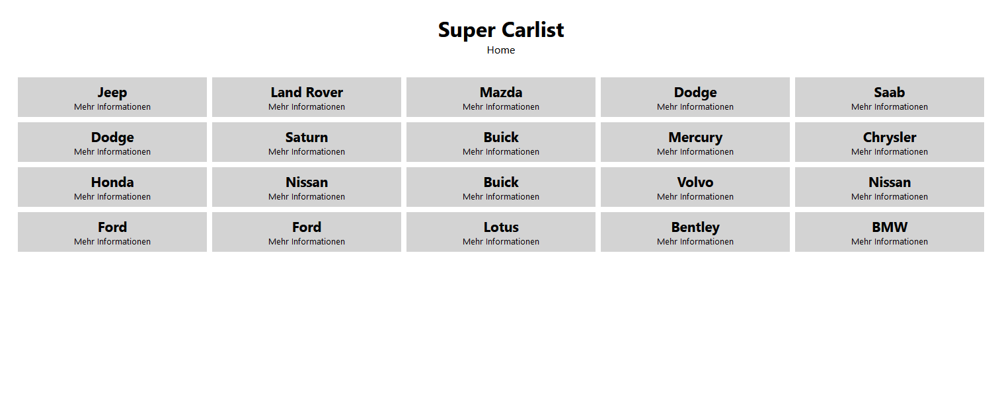
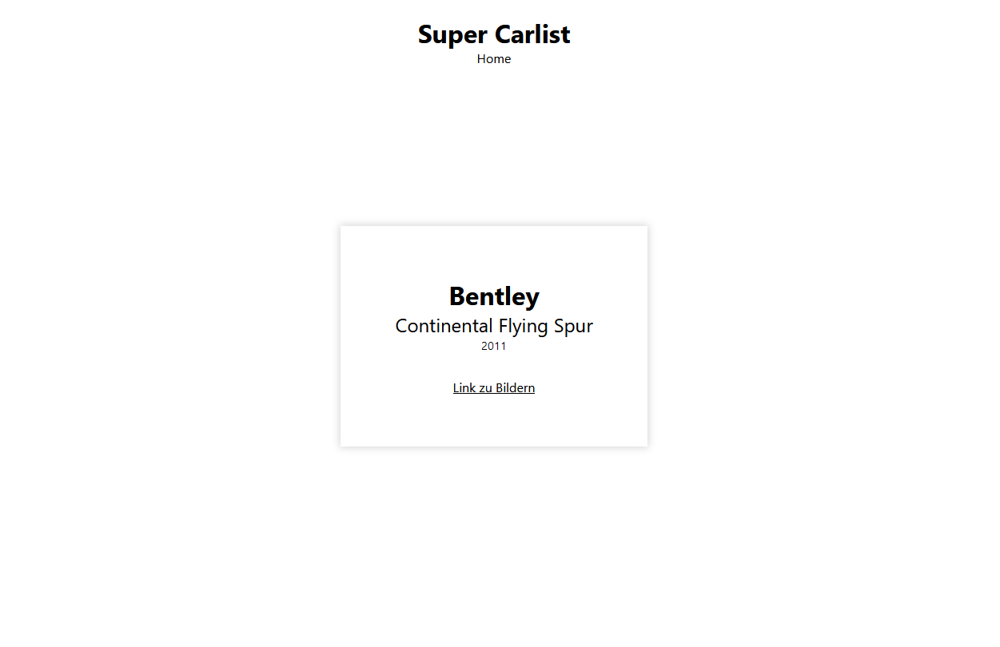
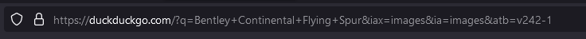
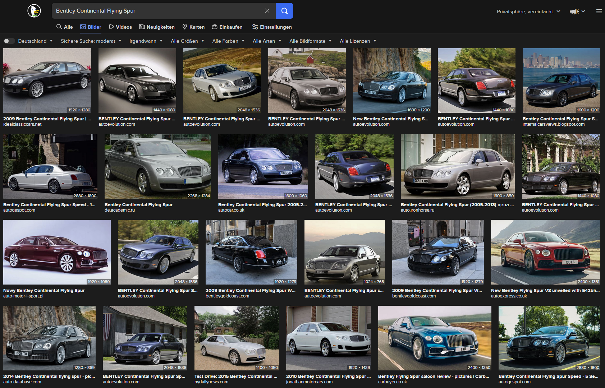

# Aufgabenstellung

Heute erstellst du mit dynamischem Routing eine Autoliste.
Die Liste soll sich aus der cars.json Datei generieren und auf der Startseite dargestellt werden. Jedes Element bekommt eine Read more Verlinkung, die zu einer Unterseite führt. Auf der Unterseite werden dann ergänzende Informationen des Autos angezeigt.

Assets
Das CSS findest du im Kommentarbereich. Die Klasse grid musst du natürlich an der richtigen Stelle in deiner App verwenden.
Im Classroom findest du eine cars.json Datei
Im Classroom findest du eine Bildschirmaufnahme der Ergebnisvorschau als Video

## Ergebnisvorschau

[label](public/assets/img/lev2_3_js-reactjs_dynamisches-routing.mov)

## Mein Ergebnis

